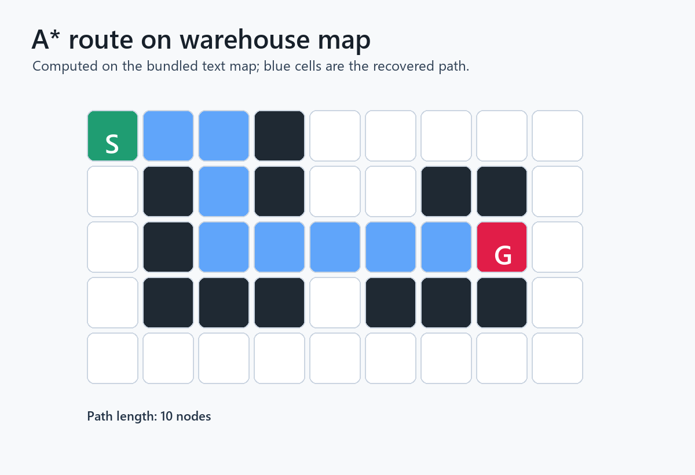

# cpp-grid-path-planner

A dependency-light C++17 grid path planner with a reusable library, a command-line tool, example maps, and a small test suite.

The planner supports A* and Dijkstra search on rectangular occupancy grids. Maps are plain text, where `#` is blocked space, `.` is free space, `S` is the start, and `G` is the goal.

## Features

- Modern C++17 library API
- A* and Dijkstra search
- Optional diagonal movement
- Text-map parser with clear validation errors
- CLI that overlays the discovered path on the map
- CMake build with CTest tests

## Build

```bash
cmake -S . -B build
cmake --build build
ctest --test-dir build --output-on-failure
```

## Run

```bash
./build/cpp-grid-path-planner --map examples/maps/warehouse.txt --algorithm astar
```

On Windows with a multi-config generator, the executable may be under `build/Debug/` or `build/Release/`.

## CLI

```text
cpp-grid-path-planner --map <file> [--algorithm astar|dijkstra] [--diagonal]
                      [--start row,col --goal row,col]
```

If `--start` and `--goal` are not supplied, the CLI uses `S` and `G` from the map file.

Example output:

```text
S*G

Path length: 3 nodes
Path cost: 2.000
Nodes expanded: 3
```

## Map Format

Every non-empty line is a grid row, and every row must have the same width.

```text
S..#....
.#.#.##.
.#...#G.
.#####..
........
```

Legend:

- `S`: start
- `G`: goal
- `#`: obstacle
- `.`: free cell

## Library Usage

```cpp
#include <grid_path_planner/AStarPlanner.hpp>
#include <grid_path_planner/Grid.hpp>

using grid_path_planner::Grid;
using grid_path_planner::Planner;
using grid_path_planner::PlannerOptions;
using grid_path_planner::Point;

Grid grid(5, 5);
Planner planner(grid);

PlannerOptions options;
options.allow_diagonal = true;

const auto result = planner.plan(Point{0, 0}, Point{4, 4}, options);
if (result.found()) {
    // result.path contains start through goal.
}
```

## Planner output



A* path recovered on the bundled warehouse text map.


## Search implementation

- Dependency-light C++17 search code with a CLI, reusable library API, and test coverage.
- Map parsing, obstacle handling, and path reconstruction on plain-text grids.
- A clean split between planner logic, input parsing, and executable entry points.


## Validation notes

- The planner targets static rectangular grids and does not model robot footprint inflation.
- The visual output is text/grid based rather than a GUI or ROS visualization.
- Next steps: add weighted cost maps, path smoothing, and benchmark maps.

